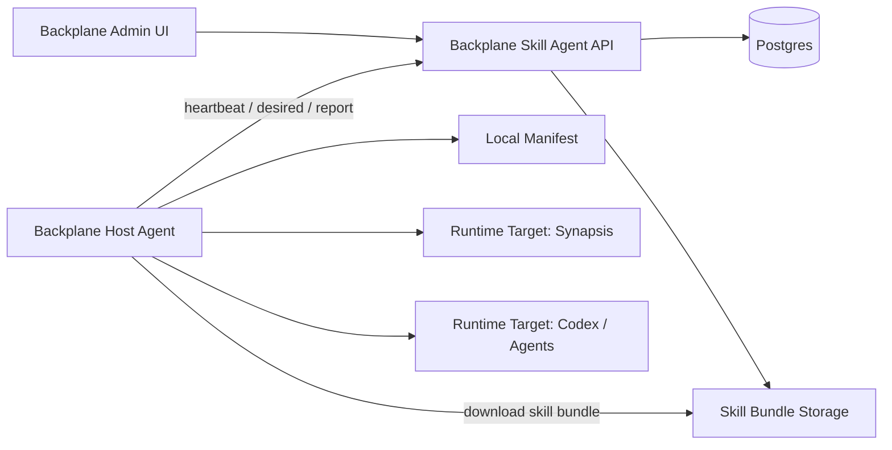

# Design Doc: Backplane Host Agent v1 — Skill Sync Only

## 1. Goal

Add a new umbrella app:

```text
apps/backplane_host_agent
```

with OTP app name:

```elixir
:backplane_host_agent
```

and root namespace:

```elixir
Backplane.HostAgent
```

The first release only implements **skill sync** from Backplane Skills Hub to local machine runtime directories.

This app is intentionally named `HostAgent`, not `SyncAgent`, because later releases may add local MCP server support, host-local tool use, host facts, and runtime integrations. However, **v1 must not implement local MCP or arbitrary tool execution**.

## 2. Product definition

Backplane Host Agent v1 is a machine-side daemon that:

1. Registers or authenticates with Backplane.
2. Fetches desired skill assignments.
3. Downloads required skill bundles.
4. Verifies checksum.
5. Installs skills into configured local target directories.
6. Maintains a local manifest.
7. Reports sync status back to Backplane.

Backplane remains the source of truth.

```text
Backplane Skills Hub
  owns skills, versions, assignments, download API, audit

Backplane Host Agent
  runs on each machine and reconciles local skill directories to desired state
```

## 3. Non-goals for v1

Do not implement these in the first release:

```text
local MCP server
local tool execution
remote shell command execution
system configuration management
NixOS module deployment
secret sync
agent task execution
LLM calls from HostAgent
multi-user permission model
distributed agent orchestration
```

The v1 agent is only a skill desired-state reconciler.

## 4. High-level architecture



## 5. Umbrella app structure

Create:

```text
apps/backplane_host_agent/
  mix.exs
  lib/
    backplane/
      host_agent.ex
      host_agent/
        application.ex
        config.ex
        client.ex
        worker.ex
        reconciler.ex
        installer.ex
        manifest.ex
        local_store.ex
        reporter.ex
        checksum.ex
        skill_bundle.ex
```

Recommended module responsibilities:

```text
Backplane.HostAgent
  public API and small facade

Backplane.HostAgent.Application
  supervision tree

Backplane.HostAgent.Config
  load config from env / TOML / runtime config

Backplane.HostAgent.Client
  HTTP client for Backplane API

Backplane.HostAgent.Worker
  periodic sync loop

Backplane.HostAgent.Reconciler
  computes desired vs installed diff

Backplane.HostAgent.Installer
  downloads, verifies, unpacks, atomically installs skill bundles

Backplane.HostAgent.Manifest
  reads/writes local installed-skills manifest

Backplane.HostAgent.LocalStore
  filesystem paths, temp dirs, target dirs

Backplane.HostAgent.Reporter
  formats heartbeat and sync result payloads

Backplane.HostAgent.Checksum
  SHA-256 helpers

Backplane.HostAgent.SkillBundle
  validates bundle shape: SKILL.md + optional meta.json
```

## 6. `backplane_host_agent/mix.exs`

Keep dependencies minimal.

```elixir
defmodule Backplane.HostAgent.MixProject do
  use Mix.Project

  def project do
    [
      app: :backplane_host_agent,
      version: "0.1.0",
      build_path: "../../_build",
      config_path: "../../config/config.exs",
      deps_path: "../../deps",
      lockfile: "../../mix.lock",
      elixir: "~> 1.18",
      start_permanent: Mix.env() == :prod,
      deps: deps()
    ]
  end

  def application do
    [
      extra_applications: [:logger, :crypto, :ssl],
      mod: {Backplane.HostAgent.Application, []}
    ]
  end

  defp deps do
    [
      {:req, "~> 0.5", override: true},
      {:jason, "~> 1.4"},
      {:toml, "~> 0.7"}
    ]
  end
end
```

Do not depend on `:backplane` in v1 unless necessary. The host agent should be releasable independently.

## 7. Host Agent runtime config

Support a local TOML file.

Default path lookup order:

```text
BACKPLANE_HOST_AGENT_CONFIG
./backplane_host_agent.toml
/etc/backplane/host_agent.toml
```

Example:

```toml
[agent]
machine_name = "t430"
hub_url = "https://backplane.gsmlg.dev"
token = "host-agent-token"
interval_ms = 60000
manifest_path = "/var/lib/backplane-host-agent/manifest.json"
work_dir = "/var/lib/backplane-host-agent/work"

[[targets]]
name = "synapsis"
runtime = "synapsis"
path = "/var/lib/synapsis/skills"
enabled = true

[[targets]]
name = "agents"
runtime = "agent-skills"
path = "/home/jonathan/.agents/skills"
enabled = true
```

Parsed internal config shape:

```elixir
%Backplane.HostAgent.Config{
  machine_name: "t430",
  hub_url: "https://backplane.gsmlg.dev",
  token: "...",
  interval_ms: 60_000,
  manifest_path: "/var/lib/backplane-host-agent/manifest.json",
  work_dir: "/var/lib/backplane-host-agent/work",
  targets: [
    %{
      name: "synapsis",
      runtime: "synapsis",
      path: "/var/lib/synapsis/skills",
      enabled: true
    }
  ]
}
```

## 8. Local skill layout

Skill bundles should remain portable and mostly unchanged.

Expected bundle content:

```text
skill-name/
  SKILL.md
  meta.json        # optional but recommended
  files...
```

Minimal `meta.json`:

```json
{
  "name": "repo-review",
  "version": "0.1.0",
  "description": "Review a repository and produce an implementation plan.",
  "tags": ["repo", "review", "planning"]
}
```

Installed target layout:

```text
<target-path>/
  repo-review/
    SKILL.md
    meta.json
    files...
  skill-creator/
    SKILL.md
    meta.json
```

Local manifest:

```json
{
  "schema_version": 1,
  "machine_name": "t430",
  "updated_at": "2026-05-21T12:00:00Z",
  "skills": [
    {
      "name": "repo-review",
      "version": "0.1.0",
      "checksum": "sha256:...",
      "targets": ["synapsis", "agents"],
      "installed_at": "2026-05-21T12:00:00Z"
    }
  ]
}
```

## 9. Server-side Backplane additions

Add server-side support inside `apps/backplane`, not inside the host-agent app.

Suggested modules:

```text
Backplane.Skills.Hosts
Backplane.Skills.Assignments
Backplane.Skills.SyncAPI
Backplane.Skills.Downloads
```

### 9.1 Database tables

Add migrations for:

```text
skill_hosts
skill_host_auth_tokens
skill_host_agent_tokens
skill_host_assignments
skill_host_statuses
```

#### `skill_hosts`

```elixir
create table(:skill_hosts, primary_key: false) do
  add :id, :binary_id, primary_key: true
  add :name, :string, null: false

  timestamps(type: :utc_datetime_usec)
end

create unique_index(:skill_hosts, [:name])
```

`skill_hosts` contains durable agent records only. Runtime state such as
connected status, agent version, targets, last seen time, and reported config is
kept in the live WebSocket connection registry only.

#### `skill_host_auth_tokens`

```elixir
create table(:skill_host_auth_tokens, primary_key: false) do
  add :id, :binary_id, primary_key: true
  add :name, :string, null: false
  add :token_hash, :string, null: false

  timestamps(type: :utc_datetime_usec)
end

create unique_index(:skill_host_auth_tokens, [:name])
```

Auth tokens are created independently from agents. The plaintext token is shown
only once on creation; Backplane stores only the hash.

#### `skill_host_agent_tokens`

```elixir
create table(:skill_host_agent_tokens, primary_key: false) do
  add :id, :binary_id, primary_key: true
  add :host_id, references(:skill_hosts, type: :binary_id, on_delete: :delete_all), null: false
  add :auth_token_id, references(:skill_host_auth_tokens, type: :binary_id), null: false

  timestamps(type: :utc_datetime_usec)
end

create index(:skill_host_agent_tokens, [:host_id])
create unique_index(:skill_host_agent_tokens, [:auth_token_id])
```

An agent may have multiple tokens for rotation. A token may be assigned to at
most one agent. Unassigned tokens cannot authenticate a host agent.

#### `skill_host_assignments`

```elixir
create table(:skill_host_assignments, primary_key: false) do
  add :id, :binary_id, primary_key: true
  add :host_id, references(:skill_hosts, type: :binary_id, on_delete: :delete_all), null: false
  add :skill_id, references(:skills, type: :binary_id, on_delete: :delete_all), null: false
  add :version, :string
  add :targets, {:array, :string}, null: false, default: []
  add :enabled, :boolean, null: false, default: true
  add :metadata, :map, null: false, default: %{}

  timestamps(type: :utc_datetime_usec)
end

create index(:skill_host_assignments, [:host_id])
create unique_index(:skill_host_assignments, [:host_id, :skill_id])
```

#### `skill_host_statuses`

```elixir
create table(:skill_host_statuses, primary_key: false) do
  add :id, :binary_id, primary_key: true
  add :host_id, references(:skill_hosts, type: :binary_id, on_delete: :delete_all), null: false
  add :skill_id, references(:skills, type: :binary_id, on_delete: :delete_all)
  add :skill_name, :string, null: false
  add :desired_version, :string
  add :installed_version, :string
  add :checksum, :string
  add :targets, {:array, :string}, null: false, default: []
  add :status, :string, null: false
  add :error, :text
  add :metadata, :map, null: false, default: %{}

  timestamps(type: :utc_datetime_usec)
end

create index(:skill_host_statuses, [:host_id])
create unique_index(:skill_host_statuses, [:host_id, :skill_name])
```

### 9.2 Versioning note

If the current `skills` table does not yet support immutable versions, do the minimum for v1:

```text
Use current skill id/name as source of truth.
Expose a synthetic version from meta.json if present.
Use content checksum as immutable identity.
```

Do not build a full `skill_versions` model in v1 unless the current implementation already has it. Add that in v2.

## 10. Server API

Add an authenticated Host Agent WebSocket channel plus the archive download API.

Recommended route prefix:

```text
/api/host-agent
```

Routes and channels:

```text
WS   /host-agent/socket/websocket
JOIN host_agent:<host_id>
PUSH heartbeat
PUSH config_report
PUSH get_desired
PUSH sync_result
GET  /api/host-agent/skills/:skill_id/download
```

### 10.1 Auth

Use the host-agent WebSocket/header token:

```http
X-Backplane-Host-Token: <token>
```

Server stores only token hashes. Tokens are created in Agent Auth and assigned
to agents in Agent Management. Only DB-created agents with assigned tokens can
connect. Agents without assigned tokens may exist but cannot authenticate.

### 10.2 Heartbeat

Heartbeat is a channel event after a successful join. It updates only the live
connection registry, not `skill_hosts`.

Payload:

```json
{
  "status": "online",
  "agent_version": "0.1.0",
  "targets": [
    {
      "name": "synapsis",
      "runtime": "synapsis",
      "path": "/var/lib/synapsis/skills",
      "enabled": true
    }
  ],
  "metadata": {
    "os": "nixos",
    "arch": "x86_64"
  }
}
```

Reply:

```json
{
  "ok": true
}
```

### 10.3 Config report

`config_report` is a separate channel event. It stores the latest agent-reported
runtime config in the live connection registry only. It is not persisted.

Payload is the agent config as JSON. Invalid non-object payloads are rejected
with `invalid_payload`.

### 10.4 Desired state

Response:

```json
{
  "schema_version": 1,
  "host": {
    "id": "uuid",
    "name": "t430"
  },
  "skills": [
    {
      "id": "uuid",
      "name": "repo-review",
      "version": "0.1.0",
      "checksum": "sha256:...",
      "targets": ["synapsis", "agents"],
      "enabled": true,
      "download_url": "/api/host-agent/skills/uuid/download"
    }
  ]
}
```

### 10.5 Sync result

Request:

```json
{
  "machine_name": "t430",
  "started_at": "2026-05-21T12:00:00Z",
  "finished_at": "2026-05-21T12:00:03Z",
  "status": "synced",
  "results": [
    {
      "skill_name": "repo-review",
      "desired_version": "0.1.0",
      "installed_version": "0.1.0",
      "checksum": "sha256:...",
      "targets": ["synapsis", "agents"],
      "status": "synced",
      "error": null
    }
  ]
}
```

Allowed status values:

```text
synced
missing
outdated
installed
updated
removed
failed
checksum_mismatch
target_missing
```

## 11. Reconciler behavior

Given:

```text
desired skills from Backplane
local manifest
configured targets
```

Compute actions:

```text
install
update
remove
repair
noop
```

Rules:

```text
If desired skill is missing locally:
  install

If desired checksum differs from local manifest:
  update

If desired targets differ from local manifest:
  update target installation

If local skill exists but is no longer desired:
  remove or disable

If installed files exist but manifest missing:
  verify and adopt if checksum matches, otherwise repair

If checksum fails after download:
  do not install; report checksum_mismatch
```

For v1, default behavior for undesired local skills:

```text
remove only skills previously installed by Backplane Host Agent
do not remove manually installed skills
```

This requires manifest ownership tracking.

## 12. Atomic install

Installer must avoid partial writes.

Algorithm:

```text
1. Download bundle to work dir.
2. Verify checksum.
3. Unpack to temporary dir.
4. Validate SKILL.md exists.
5. For each target:
   a. install to <target>/.backplane-tmp/<skill-name>-<nonce>
   b. fsync/write complete if practical
   c. rename existing <target>/<skill-name> to backup
   d. rename temp dir to <target>/<skill-name>
   e. remove backup after success
6. Update manifest only after all target installs succeed.
```

Rollback:

```text
If install fails after replacing existing skill:
  restore backup if available
  report failed
```

## 13. Worker loop

`Backplane.HostAgent.Worker` should be a GenServer.

State:

```elixir
%{
  config: config,
  manifest: manifest,
  timer_ref: ref | nil,
  last_sync: DateTime.t() | nil,
  last_error: term | nil
}
```

Loop:

```text
init
  load config
  load manifest
  schedule immediate sync

handle_info(:sync)
  heartbeat
  desired = fetch desired
  plan = reconcile desired with manifest
  execute plan
  write manifest
  report result
  schedule next sync
```

Backoff:

```text
success: use configured interval_ms
failure: min(interval_ms, 10_000) initially, exponential up to interval_ms
```

Manual trigger API:

```elixir
Backplane.HostAgent.sync_now()
Backplane.HostAgent.status()
```

## 14. Admin UI v1

Add minimal UI under existing admin.

Suggested nav under MCP Hub or Skills:

```text
Skills
  Library
  Hosts
  Assignments
  Sync Status
```

For v1, implement only:

```text
Hosts page:
  host name
  last seen
  agent version
  status
  target count

Host detail:
  desired skills
  installed skills
  status/errors

Skill detail:
  assigned hosts
```

Do not overbuild UI before protocol works.

## 15. MCP tools

Because Backplane already exposes managed services as MCP tools, add small server-side MCP tools later in the same Skills service if easy. For v1 this is optional.

Possible tools:

```text
skills::list_hosts
skills::assign_to_host
skills::host_status
```

If this delays the sync agent, skip it.

## 16. Tests

### 16.1 Host Agent unit tests

Add tests for:

```text
Config parses TOML
Manifest read/write roundtrip
Reconciler computes install/update/noop/remove
Checksum verifies sha256
Installer rejects bundle without SKILL.md
Installer installs into target atomically
Installer does not remove manually installed skills
Client signs requests with bearer token
Worker reports failure on download/checksum error
```

### 16.2 Server tests

Add tests for:

```text
auth token creation shows plaintext once and stores only hash
unassigned tokens cannot authenticate
agents can have zero or multiple assigned tokens
one token cannot be assigned to multiple agents
connected agents live registry tracks one connection per agent
heartbeat updates live registry only
config_report stores runtime config in memory only
desired endpoint returns assigned skills
download endpoint requires host token
sync result updates skill_host_statuses
disabled assignment is not returned as desired enabled skill
invalid token is rejected
```

## 17. Implementation phases for Codex

### Phase 1 — Skeleton app

1. Add `apps/backplane_host_agent`.
2. Add to umbrella compilation.
3. Create application module and worker skeleton.
4. Add config loader.
5. Add basic tests.

Acceptance:

```bash
mix compile
mix test apps/backplane_host_agent/test
```

### Phase 2 — Local manifest and reconciler

1. Implement manifest JSON read/write.
2. Implement desired/local diff.
3. Implement action model.

Acceptance:

```text
Given desired skill A and empty manifest, reconciler returns install A.
Given same checksum, reconciler returns noop.
Given changed checksum, reconciler returns update.
Given manifest-owned skill not desired, reconciler returns remove.
```

### Phase 3 — Installer

1. Download bundle through client or local test fixture.
2. Verify checksum.
3. Unpack bundle.
4. Validate `SKILL.md`.
5. Install atomically into target dirs.
6. Update manifest.

Acceptance:

```text
A valid skill bundle appears in target path.
Invalid checksum is rejected.
Missing SKILL.md is rejected.
Partial failed install does not corrupt previous skill.
```

### Phase 4 — Server API

1. Add `skill_hosts`.
2. Add `skill_host_auth_tokens` and `skill_host_agent_tokens`.
3. Add `skill_host_assignments`.
4. Add `skill_host_statuses`.
5. Add WebSocket channel and archive download route.
6. Add host token auth for host agent socket/download endpoints.
7. Implement heartbeat, config_report, desired, download, sync-result.

Acceptance:

```text
DB-created host with assigned token can connect.
Connected host can heartbeat.
Connected host can report runtime config.
Host can fetch desired assignments.
Host can download assigned skill.
Host can report sync status.
```

### Phase 5 — End-to-end sync

1. Start Backplane.
2. Add one skill.
3. Add one host.
4. Assign skill to host.
5. Run HostAgent against local test target.
6. Verify installed skill and server status.

Acceptance:

```text
Skill is installed locally.
Manifest contains installed skill.
Backplane UI/API shows host synced.
Re-running sync is idempotent.
```

## 18. Release criteria

v1 is complete when:

```text
backplane_host_agent compiles as an umbrella app
agent config can point to a Backplane server
agent can connect over WebSocket with an assigned token
host heartbeat updates live connection state
host config report is visible while connected
desired skills can be fetched
skill bundle can be downloaded and checksum verified
skill can be installed into one or more local target directories
local manifest is updated
sync result is reported to Backplane
server records per-host skill status
Backplane UI separates connected agents, agent management, and agent auth
sync is idempotent
tests cover core behavior
```

## 19. Suggested future v2 scope

After v1 skill sync is stable:

```text
local MCP server
local tool registry
host facts inventory
skill channels: stable/beta/dev
skill version history
signed skill bundles
group assignments
runtime-specific enable/disable
secret references
NixOS packaging
single-binary release
```

Do not start v2 until v1 is reliable.

## 20. Codex instruction

Implement this incrementally. Do not refactor unrelated Backplane MCP Hub or LLM Proxy code. Preserve existing Skills Hub behavior. Add HostAgent as a separate umbrella app and only add the minimum server-side API/data model needed for skill sync. Keep v1 deterministic, idempotent, and test-covered.
