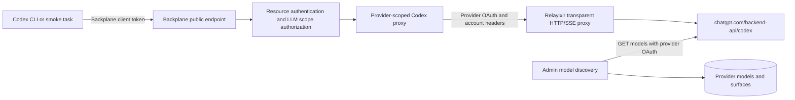

# Backplane OpenAI Codex Responses Proxy

Backplane provides a provider-scoped transparent proxy for OpenAI Codex clients.
It forwards raw Responses API request bytes, query strings, JSON responses, SSE
events, and upstream errors unchanged.

## Architecture



Direct client traffic and management model discovery are separate paths. The
direct proxy does not require a model to be present in the local catalog; the
upstream account and rollout decide whether a slug is available.

## Routes

```text
GET  /v1/providers/openai-codex/models
POST /v1/providers/openai-codex/responses
POST /v1/providers/openai-codex/responses/compact
```

They map, respectively, to `/models`, `/responses`, and `/responses/compact` on
the configured ChatGPT Codex backend. `/v1` is never repeated in the upstream
path. Query parameters, including `client_version`, are preserved.

`/responses/compact` is retained as a transparent legacy compatibility route.
Current Codex clients use remote compaction v2 instead: they POST an SSE request
to `/responses`, include `x-codex-beta-features: remote_compaction_v2`, and add a
`compaction_trigger` input item. Backplane forwards that flow without interpreting
or rewriting it.

## Codex configuration

```toml
model = "gpt-5.6-sol"
model_provider = "backplane-codex"

[model_providers.backplane-codex]
name = "Backplane OpenAI Codex"
base_url = "https://backplane.example/v1/providers/openai-codex"
env_key = "BACKPLANE_API_KEY"
wire_api = "responses"
supports_websockets = false
```

Management discovery always sends `client_version`; it uses the backend's
compatibility sentinel `0.0.0` unless `OPENAI_CODEX_CLIENT_VERSION` or the
`:openai_codex_client_version` application setting overrides it. Direct client
query parameters are forwarded unchanged.

## Credential requirements

The provider must use the `openai-codex` preset, an enabled OpenAI API surface,
and a credential whose auth type is `openai_oauth`. Backplane injects the
refreshed OAuth bearer token and `ChatGPT-Account-ID`, replacing any client
auth headers. Provider defaults are applied only when the client has not sent
that header; `originator` uses this put-if-absent behavior.

Responses WebSockets are intentionally disabled. HTTP and SSE are the only
accepted transport paths.

## Models

The provider-scoped `/models` endpoint returns the Codex backend's account- and
rollout-specific schema unchanged. Management discovery separately parses
`models[].slug`, persists unknown metadata, and keeps the previous catalog when
discovery fails or returns an empty result. Manual models are never removed.

For example, a current Codex catalog may contain `gpt-5.6-sol`,
`gpt-5.6-terra`, `gpt-5.6-luna`, `gpt-5.5`, `gpt-5.4`, `gpt-5.4-mini`, and
`gpt-5.3-codex-spark`. Backplane treats the upstream `slug` as authoritative
rather than synthesizing these names.

The global `/v1/models` endpoint remains OpenAI-compatible and is independent
from direct Codex routing.

## Chat Completions

OpenAI Codex providers support Responses only. Backplane does not convert Chat
Completions to Responses or Responses events to Chat Completions chunks.
Use `/v1/providers/openai-codex/responses` from Codex clients.

## Errors and troubleshooting

Backplane returns a local JSON error when a provider is absent, disabled, not
Codex-enabled, rate limited, or cannot provide a valid OAuth credential. Once
an upstream request starts, upstream status, headers, body, and SSE are passed
through unchanged.

If the backend returns `401`, refresh or re-import the ChatGPT OAuth credential.
If a new upstream model returns `404`, the direct route still allows the request;
the upstream decides account and rollout access.

## Security

Never send Backplane client bearer tokens through to ChatGPT. Backplane strips
or replaces provider-owned authorization headers. Telemetry records request
identity and status only; it does not log access tokens, refresh tokens, request
bodies, tool arguments, or prompts.

## Smoke test

Run a real opt-in test with an existing provider and model:

```sh
BACKPLANE_CODEX_SMOKE=true OPENAI_CODEX_CLIENT_VERSION=0.0.0 \
  BACKPLANE_API_KEY="$BACKPLANE_API_KEY" \
  mix backplane.codex.smoke --provider openai-codex --model gpt-5.6-sol
```

The command calls the Backplane public provider routes, not ChatGPT directly.
`BACKPLANE_API_KEY` is the Backplane client credential and may be omitted only
when the public endpoint is intentionally running in open mode. Set
`BACKPLANE_CODEX_BASE_URL` to override the default public API origin. The
command checks model discovery, a normal Responses turn, a forced function-tool
call, an additional streaming turn, and the current remote-compaction-v2 flow.
The ChatGPT Codex backend requires `stream: true`, so all live Responses probes
validate the native SSE protocol. Byte-preserving non-stream and legacy
`/responses/compact` behavior remain covered by local integration tests because
the currently verified ChatGPT rollout returns 404 for the legacy compact route. The
command prints statuses, request IDs, stream event counts, tool-call counts, and
compaction-item counts only. Any non-2xx response or missing expected model,
terminal SSE event, function call, or compaction item makes it exit with an error.
