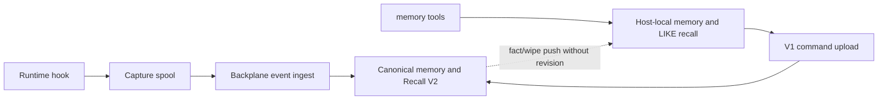
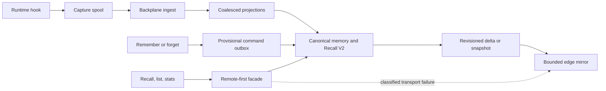

# Memory V2 PR2–PR5 final remediation report

Date: 2026-09-23 (verification and approval evidence through 2026-09-22).
Scope: local implementation and integration on `main`;
no remote push or hosted CI run. The [implementation plan](../superpowers/plans/2026-09-05-memory-v2-pr2-pr5-implementation.md)
records task commits, approvals, reviews, and command evidence. This report
describes the implemented contract; the [PR0 audit](memory-v2-implementation-audit.md)
remains a historical baseline.

## Architecture and actual defect repaired

Before PR2, the host routed connected `memory::recall` to its local Turso
`LIKE` search. Local remember/forget returned before canonical acceptance,
and V1 fact/wipe pushes had no durable revision or cursor. The capture spool
and central Recall V2 existed, but the host tool route bypassed canonical recall.

After PR2–PR5, Backplane alone owns long-term memory, partition entitlement,
governance, and revisions. The host retains three separate durable stores:
capture spool, provisional command outbox, and bounded edge mirror. Connected
reads use authenticated Backplane Recall V2. Only classified transport failure
allows explicitly stale local recall; authorization or partition errors fail
closed. The host never runs semantic consolidation or becomes a second memory
authority.

## Ownership and routing

| State | Authoritative owner | Host responsibility | Consistency and retention |
| --- | --- | --- | --- |
| Captured events and generated memories | Backplane PostgreSQL | Privacy-filtered, restart-durable capture and upload | Partial ACK; canonical event and memory lifecycle |
| Explicit remember/forget commands | Backplane after canonical ACK | Separate durable provisional outbox with canonical ID/revision settlement | Pending commands survive restart; canonical forget governs memory |
| Recall, list, stats | Backplane while connected | Bounded revisioned mirror for classified outages | Offline answers carry stale provenance/revision and quota limits |
| Slots and facets | Host device | Local-only storage and operations | Never represented as canonical server memory |
| Edge cursors, deliveries, snapshots | Backplane issues and validates; host commits mirror before ACK | Durable local cursor, hidden snapshot generation, tombstones | Monotonic revisions; replay is idempotent; old upserts cannot resurrect deletes |

| Operation | Connected route | Disconnected or rejected route |
| --- | --- | --- |
| `memory::remember`, `memory::forget` | Provisional outbox to canonical command handler | Queue provisionally; await canonical identity/revision |
| `memory::recall`, `list`, `stats` | `memory_call` with exact entitled partition; Recall V2 | Bounded mirror only on allowlisted transport failure; never on auth/partition/protocol rejection |
| Lifecycle context | Bounded Backplane `MemoryProxy` call | Separate `RecallCache` fail-open policy, not V2 mirror |
| Capture | `host_events.v1` batch to canonical ingest | Durable spool, later partial ACK/retry |
| Slots/facets | Device-local | Device-local |

The [host protocol](host-memory-v2-protocol.md) defines the exact wire fields,
hashes, limits, error taxonomy, and ACK transaction boundaries. The
[capability matrix](../qualification/memory-v2-capability-matrix.md) inventories
the public REST, MCP, UI, and test surfaces.

## Protocol, migrations, and rollback

`host_memory.v2` is negotiated separately from V1. One connection selects one
protocol; V2 does not silently downgrade. V1 fact/wipe compatibility remains
behind `memory.host_sync_v1.enabled` (default true); V2 is behind
`memory.host_sync_v2.enabled` (default false). V1 payload hashes never become
V2 cursors. A `memory_next` delivery is a bounded contiguous delta or a
materialized, chunk-hashed snapshot. The host commits delta rows/tombstones
and cursor atomically before `memory_ack`; a snapshot activates only after all
chunks and the manifest verify. The server advances only on an issued,
partition-matched, hash-matched ACK. Gaps and expired history require snapshot
recovery; duplicates do not mutate state.

Server migrations through `20260905000011` add canonical memory-space identity,
revisioned edge feed/cursors/snapshots, payload priority, complete-partition
guards, coalesced projection frontiers, expanded processing states, eligible
host episodic changes, and the action-edge trigger optimization. Host command
store V1→V2→V3 and edge migrations preserve existing commands, tombstones,
canonical mapping, and revision state. Packaged-release qualification applied
106 migrations to a fresh database, then zero on a second pass, at head
`20260905000011`.

Rollback is flag-first: disable V2 and host edge, retain V1 command upload,
and preserve capture spool, outbox, mirror, server cursors, and issued deliveries.
Migrations 00007 and 00011 are irreversible; crossing that schema boundary
requires restore of a tested backup plus replay of accepted canonical events,
not a blind `ecto.rollback`. The [release plan](../deploy/memory-v2-release.md)
gives the exact export/replay and cutover sequence.

## Acceptance evidence and measured bounds

Automated A–J scenarios cover outage capture, online canonical recall,
restart-durable bounded offline recall, unsafe-fallback rejection,
read-your-writes, live delta convergence, delete/tombstone convergence,
storage bounds, complete partition before ACK, and 10,000-event projection
coalescing. Additional tests exercise real PostgreSQL transactions, Turso
upgrade/reopen/recovery, channel transport, snapshots, duplicate/conflicting
ACKs, migration preservation, privacy, and release packaging.

At three deterministic A–I seeds (101, 202, 303), the bounded-storage fixture
retained three items at 1,033–1,039 bytes, two at 691–695 bytes, and one at
346–348 bytes under its configured quotas. The 10,000-event real-store case
observed 101 durable frontier generations and one pending projection-repair
job at the measured point; projection/replay completed in bounded batches.
These are correctness-fixture measurements, not production throughput claims.

The feature branch's final clean umbrella run passed every app suite; the
merged `main` run on isolated `_mv2mergedfullfinal00011` also exited zero,
including Memory 1,238/1,238, MCP 665/665, Admin 321/321, Host Agent
509/509, and API 275/275. Merged formatting and warnings-as-errors compilation
passed; root release-config passed 14/14 and CI-workflow contract 4/4. The
focused release qualification batches passed 50/50 and 35/35; browser,
Recall CI, and M18 CI qualification passed. The packaged production release
smoke passed as above. These are local results; hosted CI was not run or
claimed, and nothing was pushed.

Two merged static-analysis gates remain red on unchanged `main` code. Strict
Credo reports five findings in `api_usage_live.ex`, LLM `router.ex`, and
`model_response_test.exs`. Dialyzer reports 169 errors, 138 skipped warnings,
and 35 unnecessary skips, led by AgentRuntime and SkillProtocol. The user
approved documenting these as pre-existing baseline exceptions on 2026-09-22
without expanding the Memory PRD repair scope. The feature branch's own
Credo and Dialyzer gates passed before integration; this waiver does not
represent a green merged static gate.

## Remaining issues and deployment restriction

The supported Turso encryption option tracked by
[concord#91](https://github.com/gsmlg-dev/concord/issues/91) was still open on
2026-09-22. Production plaintext edge persistence is rejected before path
creation, so persistent offline edge recall must stay disabled in production
until supported protection is available and qualified. Dev/test plaintext is
an explicit opt-in only. No other P1/P2 Memory acceptance defect was found in
the local A–J, migration, and merged-suite audit. The approved unrelated
static-analysis debt remains visible above and should be handled in its own
scope; hosted CI and deployment were not part of this local integration.
