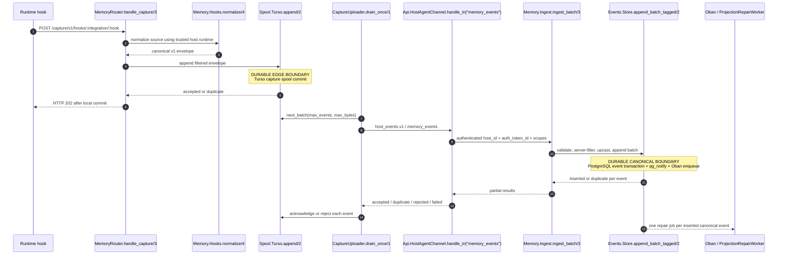
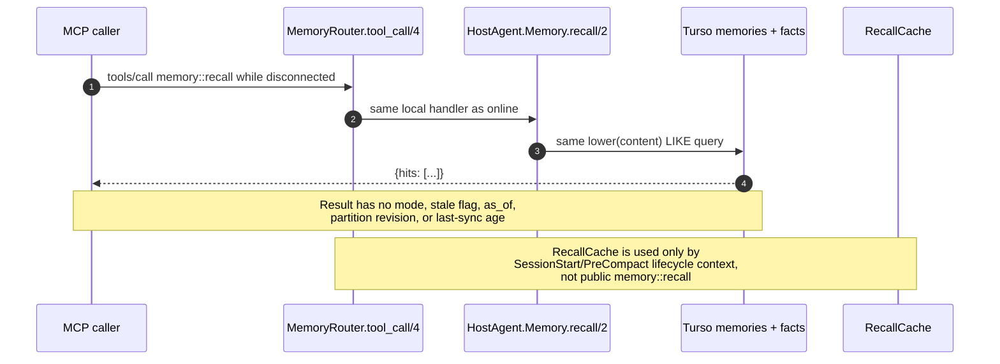
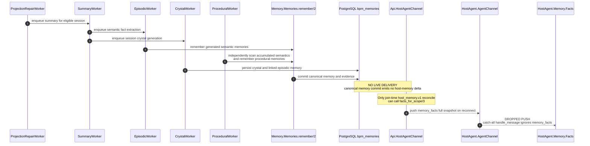
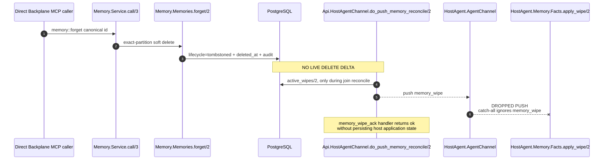
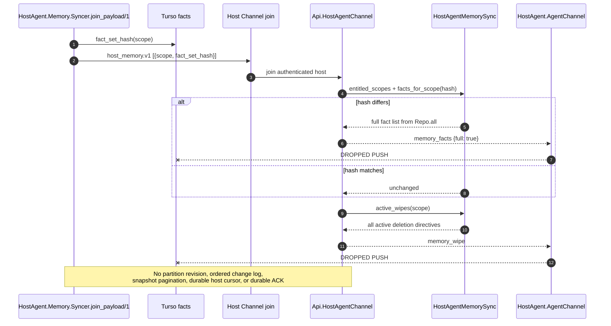

# Memory V2 Implementation Audit

Status: PR0 implementation audit; no behavior change

Baseline: `55835fbd799c81238e455446f8fa43701a5adda6`

Date: 2026-08-29

Scope: `backplane_host_agent`, the host-agent Channel boundary, and `backplane_memory`

## 1. Scope and source order

This document records behavior observed at the baseline above. It does not describe a completed remediation. Statements labelled **current** are source-backed observations; statements labelled **intended** are requirements from the approved Memory V2 design/PRD or the remediation handoff.

Sources were applied in this order:

1. `docs/memory/backplane-memory-agentmemory-parity-design-v2.md`
2. `docs/memory/backplane-memory-agentmemory-parity-prd-v2.md`
3. `docs/host-agent-memory-design-final.md`
4. `docs/memory-design.md`
5. `docs/memory-prd.md`
6. the repository-root and path-applicable `AGENTS.md` instructions
7. `docs/memory/backplane-memory-v2-codex-handoff.md`
8. source at `55835fbd799c81238e455446f8fa43701a5adda6`

The tracked v2 documents define the product boundary: `backplane_memory` is the sole long-term authority; host-agent is an edge collector, durable transport, provisional command outbox, and bounded non-authoritative cache. The handoff refines this into remote-first online reads, strict fallback classification, complete server-derived partitions before ACK, and revisioned edge convergence. `docs/memory/backplane-memory-v2-codex-handoff.md` is written as a repository-relative destination, but the reviewed handoff was external and untracked at this baseline; this audit is therefore self-contained and does not depend on that file being present in a checkout. The older host-agent design's local-first authority is the material conflict and is recorded in Section 11. Review of `docs/memory-design.md`, `docs/memory-prd.md`, and the applicable `AGENTS.md` instructions found no additional authority conflict beyond the distinctions already recorded here. No additional conflicts were identified in those sources. Current source does not yet enforce the v2 refinements.

## 2. Executive finding

The capture and central recall foundations are real, but the public host memory path still implements the older local-first product:

- **Current:** `host_events.v1` is wired end to end with privacy-before-spool persistence, restart-durable upload, partial durable PostgreSQL ACK, retry, and dead-letter handling.
- **Current:** Recall V2 is substantially implemented in `Backplane.Memory.Recall.Pipeline.run/2`, including query planning, concurrent FTS/vector/graph retrieval, weighted RRF, lifecycle/diversity handling, optional reranking, token packing, provenance validation, and persisted traces.
- **Current defect:** host-agent `memory::recall` never reaches that pipeline. `Backplane.HostAgent.MemoryRouter.tool_call/4` resolves the local `memory` service first, and `Backplane.HostAgent.Memory.recall/2` executes the same Turso `lower(content) LIKE ?` query whether the Channel is healthy or absent.
- **Current defect:** `remember` and `forget` are local-first commands. Remember eventually creates a canonical memory, but forget only records a host-local revocation mapping on the server; it does not tombstone the canonical memory.
- **Current defect:** join-time `host_memory.v1` reconciliation compares a full-set hash and pushes full facts/wipes, but the host Channel client ignores both pushes and server ACK handlers persist nothing. There are no revisions, change log, or durable host cursors.
- **Intended:** online reads are canonical, offline reads are bounded and visibly stale, local commands reconcile to canonical identity/revision, and reconnect converges by monotonic revision.

PR0 records these gaps. It does not fix them.

## 3. Baseline validation

### 3.1 Environment prerequisite

The isolated worktree used the locked dependencies and a worktree-local test database:

```bash
HEX_HTTP_CONCURRENCY=1 HEX_HTTP_TIMEOUT=300 devenv shell -- mix deps.get
devenv up -d postgres
devenv shell -- env MIX_ENV=test mix ecto.create
devenv shell -- env MIX_ENV=test mix ecto.migrate
```

### 3.2 Observed commands and results

| Command | Result at baseline |
|---|---|
| `devenv shell -- mix format --check-formatted` | Pass |
| `devenv shell -- mix compile --warnings-as-errors` | Pass |
| `devenv shell -- mix test` | Fail. `backplane_memory`: 1,055 tests, 8 failures. `backplane_mcp`: 621 tests, 1 failure. Other suites shown in the umbrella run were green. |
| `devenv shell -- env MIX_ENV=test mix test apps/backplane_memory/test` | Fail. 1,055 tests, 3 failures. |
| `devenv shell -- mix credo --strict` | Fail. 10 warnings and 5 refactoring opportunities. |
| `devenv shell -- mix dialyzer --format raw` | Fail. 256 errors, 179 skipped warnings, and 10 unnecessary skips. |

The eight full-run Memory failures were:

- five notification tests in `apps/backplane_memory/test/backplane/memory/events/event_notifier_test.exs` (all except the outer-transaction rollback test);
- `ActivityNotifierTest`: “broadcasts partition-safe activity invalidation only after projection commit” in `apps/backplane_memory/test/backplane/memory/activity_notifier_test.exs`;
- `GeneratedSkillsTest`: “relevant runtime setting changes reconcile the advertised inventory” in `apps/backplane_memory/test/backplane/memory/generated_skills_test.exs`;
- the `session_handoff` lesson/crystal capability-packing test in `apps/backplane_memory/test/backplane/memory/prompts_test.exs`.

The isolated Memory rerun failed only ActivityNotifier, GeneratedSkills runtime reconciliation, and Prompts capability packing. The MCP failure was prompt ordering in `Backplane.Transport.ModernMcpTest` at `apps/backplane_mcp/test/backplane/transport/modern_mcp_test.exs`.

Credo strict grouped the baseline findings as follows:

- **Five refactoring opportunities:** the negated branch in `apps/backplane_memory/lib/backplane/memory/coordination/lease.ex:Backplane.Memory.Coordination.Lease.acquire/4` (line 61); three inline-binding/conditional complexity sites in `apps/backplane_memory/lib/backplane/memory/recall/adapters.ex:Backplane.Memory.Recall.Adapters.artifact_partition/2` (lines 245 and 246) and `:validate_empty_partition/1` (line 259); and the inline binding in `apps/backplane_memory/lib/backplane/memory/context.ex:Backplane.Memory.Context.partition_from_opts/1` (line 67).
- **Ten warnings:** `apps/backplane_memory/lib/backplane/memory/memories/search.ex:Backplane.Memory.Memories.Search.apply_reranking/3` (line 247); `apps/backplane_memory/lib/backplane/memory/workers/crystal_worker.ex:Backplane.Memory.Workers.CrystalWorker.allow_sandbox/1` (line 237); `apps/backplane_memory/lib/backplane/memory/recall/store.ex:Backplane.Memory.Recall.Store.finite_number?/1` (line 638); `apps/backplane_memory/lib/backplane/memory/recall/reranker.ex:Backplane.Memory.Recall.Reranker.finite?/1` (line 301); `apps/backplane_memory/lib/backplane/memory/recall/query_plan.ex:Backplane.Memory.Recall.QueryPlan.numeric/1` (line 272); `apps/backplane_memory/lib/backplane/memory/recall/post_fusion.ex:Backplane.Memory.Recall.PostFusion.finite?/1` (line 173); `apps/backplane_memory/lib/backplane/memory/recall/packer.ex:Backplane.Memory.Recall.Packer.finite?/1` (line 142); two sites in `apps/backplane_memory/lib/backplane/memory/recall/candidate.ex:Backplane.Memory.Recall.Candidate.unit_float/2` (line 189) and `:finite?/1` (line 296); and `apps/backplane_mcp/lib/backplane/proxy/upstreams.ex:Backplane.Proxy.Upstreams.runtime_config/1` (line 78).

The raw Dialyzer output was not checked into PR0. Its totals remain 256 errors, 179 skipped warnings, and 10 unnecessary skips; representative current diagnostics group as:

- **Unreachable or non-matching clauses/branches:** `apps/backplane_api/lib/backplane/api/host_agent_memory_sync.ex:Backplane.Api.HostAgentMemorySync.find_local_mapping/3` (line 204) and `:find_revoked_mapping/3` (line 219); `apps/backplane_host_agent/lib/backplane/host_agent/memory/import.ex:Backplane.HostAgent.Memory.Import.walk/7` (lines 193 and 195); `apps/backplane_memory/lib/backplane/memory/crystals.ex:Backplane.Memory.Crystals.build_action_chain/3` (line 36); `apps/backplane_memory/lib/backplane/memory/lessons.ex:Backplane.Memory.Lessons.strengthen/6` (line 216); and `apps/backplane_memory/lib/backplane/memory/memories.ex:Backplane.Memory.Memories.apply_exact_partition/2` (line 575).
- **Opaque `MapSet` comparison/call warnings:** `apps/backplane_host_agent/lib/backplane/host_agent/memory/import.ex:Backplane.HostAgent.Memory.Import.walk_link/7` (lines 236 and 248); `apps/backplane_memory/lib/backplane/memory/config.ex:Backplane.Memory.Config.bounded_channel_map/3` (line 363); `apps/backplane_memory/lib/backplane/memory/memories/relation_classifier.ex:Backplane.Memory.Memories.RelationClassifier.entity_overlap?/2` (line 471); `apps/backplane_memory/lib/backplane/memory/memories/relations.ex:Backplane.Memory.Memories.Relations.supersession_reaches?/3` (lines 621 and 627); and `apps/backplane_memory/lib/backplane/memory/memories/verification.ex:Backplane.Memory.Memories.Verification.summaries/2` (lines 214 and 215).
- **Task-module analysis:** additional `Mix.Task` unknown-function and callback warnings across custom Mix tasks. These are included in the totals but are not reproduced here because the raw analyzer output is not a PR0 artifact.

These are baseline failures, not PR0 regressions. PR0 does not remediate the test, Credo, or Dialyzer findings.

## 4. Actual runtime sequences

### 4.1 Automatic capture



The path is durable and partial-ACK capable. Its partition is not complete before ACK: `EventValidator` treats `scope` as optional, `Upcaster.V1.upcast/2` persists the source value unchanged, and `Projections.Rebuild.canonical_partition/1` may reject the already-ACKed session later.

### 4.2 Explicit `memory::remember`

```mermaid
sequenceDiagram
    autonumber
    participant C as MCP caller
    participant MR as MemoryRouter.tool_call/4
    participant LS as HostAgent.Services.Memory.call/3
    participant LM as HostAgent.Memory.remember/2
    participant T as Turso memories + memory_outbox
    participant SY as Memory.Syncer.drain_once/1
    participant HC as Api.HostAgentChannel.handle_in("memory_sync")
    participant HS as HostAgentMemorySync.apply_sync_item/2
    participant BM as Memory.Memories.remember/2

    C->>MR: tools/call memory::remember
    MR->>LS: local prefix resolves first
    LS->>LM: remember(args)
    LM->>T: insert local memory + remember outbox in one transaction
    Note over T: DURABLE PROVISIONAL BOUNDARY<br/>local id is returned before Backplane accepts it
    LM-->>C: {id, scope, dedup, sync_state: pending}
    SY->>T: claim pending as inflight
    SY->>HC: host_memory.v1 memory_sync
    HC->>HS: apply remember for registered host/scope
    HS->>BM: remember with client_id = host:<host_id>
    Note over BM: DURABLE CANONICAL BOUNDARY<br/>bpm_memories + remember request/evidence
    BM-->>HS: canonical memory id
    HS-->>SY: ok or duplicate + canonical_id
    SY->>T: mark outbox done; set remote_id and synced_at
```

This gives local read-your-writes, but there is no facade result identifying provisional authority, no canonical revision, and no deduplicating merge between local and canonical recall.

### 4.3 Online `memory::recall`

```mermaid
sequenceDiagram
    autonumber
    participant C as MCP caller
    participant MR as MemoryRouter.tool_call/4
    participant R as Services.resolve/1
    participant LS as HostAgent.Services.Memory.call/3
    participant LM as HostAgent.Memory.recall/2
    participant T as Turso memories + facts
    participant BP as Backplane Recall V2

    C->>MR: tools/call memory::recall
    MR->>R: resolve("memory::recall")
    R-->>MR: local Memory service
    MR->>LS: call("recall", args, ctx)
    LS->>LM: recall(args)
    LM->>T: lower(content) LIKE query over local memories UNION facts
    T-->>C: {hits: [...]}
    Note over MR,BP: DROPPED CANONICAL ROUTE<br/>Channel health is not consulted;<br/>MemoryProxy and Recall.Pipeline are not called
```

### 4.4 Offline `memory::recall`



There is consequently no unsafe-fallback classifier for public recall: authorization, validation, transport, and server failures are never distinguished because the server is never called.

### 4.5 Fact generation and host delivery



`Backplane.HostAgent.Memory.Facts.apply_facts/2` exists and is transactional, but no `AgentChannel.handle_message/3` clause invokes it.

### 4.6 Canonical deletion and host wipe



The host-originated alternative is weaker: `HostAgentMemorySync.apply_sync_item/2` for `forget` calls `revoke_mapping/2`, inserting `bpm_host_memory_revocations`; it never calls `Backplane.Memory.Memories.forget/2`, so the canonical memory remains active.

### 4.7 Reconnect and reconciliation



## 5. Ownership and storage matrix

| State | Current writer | Current reader | Current authority | Intended authority | Retention | Encryption | Known defect |
|---|---|---|---|---|---|---|---|
| Capture spool event | `MemoryRouter.handle_capture/3`; `Spool.Turso.append/2` | `CaptureUploader.drain_once/1` | Host until accepted/duplicate ACK | Host until durable canonical ACK | Pending until ACK; retry/dead-letter state | Optional field encryption through `Spool.Cipher` | Correctly separate, but accepted event may still contain a non-canonicalizable source partition |
| Canonical event | `Memory.Ingest.ingest_batch/3` via `Events.Store.append_batch_tagged/2` | projections, replay, audit, workers | Backplane PostgreSQL | Backplane PostgreSQL | Unbounded source evidence under current policy | No application-level field encryption identified | `scope` may be nil or inconsistent after accepted ACK |
| Provisional command | `HostAgent.Memory.remember/2` and `forget/2` plus `insert_outbox/5` | `Memory.Syncer.drain_once/1`; local recall/list | Host command durability; currently presented as ordinary memory | Host only until canonical ACK/revision | `done` and `failed` rows are not pruned | Plain Turso rows | First retryable application error becomes permanently unclaimable `failed` |
| Canonical memory | `Memory.Memories.remember/2`; generation workers | Recall V2, tools, UI, host fact adapter | Backplane | Backplane | Lifecycle/retention policy; evidence retained | No application-level content encryption identified | Worker paths can persist missing `client_id`; host forget is revocation-only |
| Host `facts` row | `Memory.Facts.apply_facts/2` (currently unreachable from Channel) | local `recall/2` and optional `list/2` | Intended as a read-only copy; currently part of the primary host recall result | Bounded non-authoritative edge mirror | No fact pruning, byte cap, item cap, quota, or expiry | Plain Turso | Missing canonical type, lifecycle, revision, authority, expiry, priority, and bounded provenance |
| Recall cache entry | lifecycle `MemoryRouter.live_context/3` | `maybe_cached_context/3` for SessionStart/PreCompact only | Non-authoritative volatile cache | Non-authoritative bounded cache | 128 entries, 2 MiB, 15-minute default TTL | Process memory only | Not persistent and not used for public offline recall |
| Tombstone / revocation | Host `Facts.apply_wipe/2` writes `tombstones`; server `HostAgentMemorySync.revoke_mapping/2` writes `bpm_host_memory_revocations` | host relearn guard; server host mapping resolution | Split: local hash tombstone and server mapping revocation | Backplane governance projection/change log | No bounded cleanup policy | Plain Turso locally; PostgreSQL server-side | Local PK is `content_hash` only; revocation does not delete canonical memory |
| Slot | `HostAgent.Memory.slot_write/2` | local slot read/list | Device-local host state | Decision gate: retain explicit device-local authority/consistency under `memory::*`, or amend the authoritative design/PRD before introducing another namespace | Indefinite | Plain Turso | Current schemas do not make device-local authority or consistency explicit |
| Projection state/snapshot | `Projections.Rebuild` and selected workers | admin/operations, subsequent workers | Derived Backplane read model | Derived and rebuildable from canonical sources | Indefinite/current operations policy | PostgreSQL | Generic states omit reason-specific skipped states; several generators record no state at all |
| Oban job | event append and workers | Oban executors/operations | Durable work intent, not domain authority | Same | Oban queue/pruning policy | PostgreSQL | One projection repair job is scheduled per event and each repair rebuilds the full session |

## 6. `memory::*` routing matrix

The “remote handler” column is code that exists on the server. It is not evidence that the host MCP route reaches it.

Namespace decision gate: the tracked v2 design/PRD fixes all public MCP tools under `memory::*`. The later handoff suggests `host_memory::*` only as a practical boundary for device-local operations; that suggestion does not override the authoritative documents. This audit therefore does not mandate a parallel namespace. Later work must either retain `memory::*` with explicit device-local authority/consistency and compatible connected/disconnected schemas, or first amend and approve the design/PRD before introducing `host_memory::*`.

| Tool | Local handler/result/schema | Remote handler/result/schema | Current online behavior | Current offline behavior | Fallback class | Authorization boundary | Authority classification / intended behavior |
|---|---|---|---|---|---|---|---|
| `memory::remember` | `HostAgent.Memory.remember/2` → `{id, scope, dedup, sync_state}` | `HostAgentChannel.dispatch_memory/4` → `Memory.Service.handle_remember/2` → `{id, scope, memory_type}` | Local Turso transaction first; async `host_memory.v1` sync | Same provisional write; outbox waits | Not a fallback; always local-first | Local route trusts bound/known scope; server later requires global `host_agent.import` and derives `host:<host_id>` | Keep transactional provisional outbox, but label provisional and reconcile canonical ID/revision |
| `memory::recall` | `HostAgent.Memory.recall/2` → `{hits}` from local LIKE | `Memory.Service.call/3` → `do_handle_recall_v2/2` → Recall V2 result/trace | Local LIKE; server not called | Same local LIKE | No classifier | Local route has no Backplane authorization; server path would require `host_agent.recall`/`memory.read` and exact partition | Remote-first; local edge mirror only on enumerated transport failure, with stale metadata |
| `memory::list` | `HostAgent.Memory.list/2` → `{items}` | `Memory.Service.call/3` → `{results}` | Local list | Local list | None | Same mismatch as recall | Canonical online; explicitly bounded/stale offline only if approved |
| `memory::forget` | `HostAgent.Memory.forget/2` → `{id, scope, sync_state}` and outbox | `Memory.Service.call/3` → `{id, status: deleted}` | Local soft delete, then server revocation-only mapping | Local soft delete waits in outbox | Not classified | Server Channel maps this method to `host_agent.import`/`memory.write`; the sync adapter validates registered host scope, resolves the host-local mapping, and validates an optional remote ID, but bypasses the canonical deletion/lifecycle transition | Provisional delete command followed by canonical tombstone/delete revision |
| `memory::stats` | `HostAgent.Memory.stats/2` → local grouped counts | `Memory.Service.call/3` → canonical counts by type | Local stats | Local stats | None | No remote auth online | Canonical online; offline response must identify local-only scope and age |
| `memory::slot_read` | `HostAgent.Memory.slot_read/2`; accepts `key` or `name` plus optional `scope`; returns `{scope, key, value, updated_at}`. Advertisement has no input schema. | Extended `Memory.Service.do_handle_slot_read/1`; requires `name`; returns `{name, content, updated_at, updated_by, size_limit_chars}`. | Always reads the local Turso slot because the local prefix wins; canonical slot is hidden | Same local read | None | Local bound/known-scope check only; remote tool would require canonical Memory permission and exact partition | **Device-local today.** Decision gate: retain `memory::*` and make device-local authority/consistency plus schema compatibility explicit, or first amend/approve the design/PRD before adding a parallel namespace |
| `memory::slot_write` | `HostAgent.Memory.slot_write/2`; accepts `key`/`name`, `value`/`content`, optional `scope`; returns `{scope, key, value, updated_at}`. Advertisement has no schema. | Extended `Memory.Service.do_handle_slot_write/1`; requires string `name` and `content`, optional `updated_by`; returns `{name, updated_at}`. | Always writes local Turso; no command outbox or canonical write | Same local write | None | Local scope resolver only; remote tool would require Memory write permission and exact partition | **Device-local authority today.** Apply the same namespace decision gate; PR0 does not rename or promote this state |
| `memory::slot_list` | `HostAgent.Memory.slot_list/2`; optional `scope`; returns `{slots: [{scope, key, value, updated_at}]}`. Advertisement has no schema. | Extended `Memory.Service.do_handle_slot_list/1`; empty public schema; returns canonical `{slots: [{name, content, updated_at, updated_by, size_limit_chars}]}`. | Always lists local Turso slots | Same local list | None | Local bound/known-scope check only; remote tool would require Memory read permission and exact partition | **Device-local today.** Retain `memory::*` with explicit authority/consistency and compatible result schema unless an approved design/PRD amendment authorizes a parallel namespace |
| `memory::facet_tag` | `HostAgent.Memory.facet_tag/2`; requires local `id`, accepts replacement `tags`/`metadata`; returns `{id, scope, tags, metadata}`. Advertisement has no schema. | Core `Memory.Service.do_handle_facet_tag/1`; requires canonical `memory_id` and `facets: [{dimension, value}]`; returns `{tagged}`. | Mutates only the local provisional row; the mutation is not added to the outbox | Same local-only mutation | None | Local ID lookup only; remote path would validate the owned canonical memory and Memory write permission | **Local provisional mutation today; canonical authority intended.** Retain the authoritative `memory::*` namespace while aligning authority, consistency, schema, and synchronization unless the design/PRD is amended first |
| `memory::facet_query` | `HostAgent.Memory.facet_query/2`; accepts local `facet`/`metadata` object plus optional `q`, `tag`, `scope`, `limit`; returns `{items}`. Advertisement has no schema. | Core `Memory.Service.do_handle_facet_query/1`; requires `facets: [{dimension, value}]`, optional `limit`; returns canonical `{results}`. | Queries only local memories, never Backplane facets | Same local query | None | Local bound/known-scope check only; remote tool would require Memory read permission and exact partition | **Local degraded read today; canonical authority intended.** No offline facet-query contract or namespace change is approved; apply the decision gate before implementation |
| `memory::replay_import` | `HostAgent.Services.Memory.replay_import/2`; requires configured `profile` and a Channel in call context; returns `{status: accepted, batch_id, request_id}`. Advertisement has no schema. | Extended/feature-gated `Memory.Service.do_handle_replay_import/1`; schema requires `profile`, optional `request_id`/`integration`; returns a sanitized dispatched report. | Host MCP supplies no Channel in `tool_ctx/2`, so the advertised local call returns capture unavailable. Direct Backplane dispatch sends `memory.replay_import`, but `AgentChannel` resolves only `memory::...`, so that path rejects it as unknown | Capture unavailable/not connected; no local enqueue contract | No fallback; import is a host-only operation requiring a live control path | Local HTTP has no Backplane authorization; remote tool requires replay/import permission, exact partition, feature enablement, and connected entitled host | **Host-executed operation under canonical Backplane authorization.** It is neither canonical memory data nor an offline fallback and is currently not end-to-end callable |
| `lifecycle_context` | No public local tool. Capture path calls `MemoryProxy.call/3`; `RecallCache` may supply stale lifecycle context | `HostAgentChannel.dispatch_memory/4` → `Memory.Service.handle_lifecycle_context/2` | Remote bounded call from SessionStart/PreCompact; transport-only cached fallback | Cached lifecycle context or no injection | `MemoryRouter.transport_unavailable?/1`; timeout fails open without cache in the timeout branch | `host_agent.recall`; server derives exact partition | Preserve this bounded, fail-open pattern; add durable revision metadata if cached |
| Unknown Hub `memory::*` | Prefix resolves to `HostAgent.Services.Memory`; unknown bare method errors locally | Hub registry may contain a valid canonical tool | Never routed to Hub | Local unknown-method error | None | Hub authorization never runs | Permit canonical facade/Hub tools under the authoritative `memory::*` namespace; introduce no parallel namespace without a prior approved design/PRD amendment |

Schema parity is also absent: `HostAgent.Services.Memory.tools/0` advertises only name/description, while `Memory.Service.tools/0` publishes canonical input schemas and permissions. Result keys differ (`hits` versus `results`, local versus canonical IDs) and no consistency envelope reconciles them.

## 7. Identity and authorization inventory

| Concept | Current source and use | Authority today | Required distinction |
|---|---|---|---|
| Authenticated host ID | `socket.assigns.host.id`; checked by `HostAgentChannel.join/3` and batch host match | Trusted transport identity | Capture provenance and delivery target, not long-term owner by itself |
| Host token | `socket.assigns.auth_token.id` becomes `ingest_auth_token_id` | Trusted token/audit identity | Keep distinct from host and memory-space identity |
| Global host-agent permission | `HostAgentChannel.host_agent_scopes/0` reads one application-wide allowlist | Controls capture/recall/import for every connected host, rather than token-specific permissions | Derive effective permissions from the authenticated credential/registration and audit them |
| `host:<host_id>` owner partition | Built in `host_memory_auth/2` and `Upcaster.V1.upcast/2`; `Partition.resolve/1` expects it in principal metadata | Current canonical owner key | Compatibility mapping to a stable `memory_space_id` |
| Registered `memory_scope` | `Backplane.Skills.Host.memory_scope`; enforced by `Partition.resolve/1` and `HostAgentMemorySync.validate_host_scope/2` | Canonical scope for direct/sync calls | Server-derived subpartition; source claims may only match it, never grant it |
| Source `client_id` | Hook envelope uses values such as `codex-cli` | Not retained distinctly: `Upcaster.V1.upcast/2` overwrites it with `host:<host_id>`, including `raw_envelope` | Rename/persist as `source_client_id` provenance |
| Runtime integration | Envelope `integration`, e.g. `codex` | Provenance | Preserve as provenance, never owner/authorization |
| Project | Source working directory/project label | Provenance; may be nil | Preserve as provenance/filter only; do not derive entitlement from a path |
| Source `scope` | Hook adapter derives it from source scope or `project:<cwd>` | Currently persisted and ACKed without canonical validation | Validate against/replace with registered canonical scope before ACK |
| Namespace | Upcaster hardcodes `private` | Canonical visibility/lifecycle namespace | Continue server-derived; version any future sharing semantics |
| Proposed `memory_space_id` | Not implemented | None | Stable authoritative owner; initially one private space per registered host |
| Proposed `source_client_id` | Not implemented as a separate canonical field | None | Runtime provenance only |

The most important collision is `client_id`: current hooks mean “source runtime”, while canonical events/memories mean “owner partition.” The upcaster silently changes the meaning instead of retaining both concepts.

## 8. Defect register

### P0 — correctness, security, or data-loss risk

| ID | Defect and impact | Exact source references |
|---|---|---|
| P0-01 | Public host `memory::*` routing is local-first. Online recall bypasses Recall V2 and returns degraded local LIKE results. | `apps/backplane_host_agent/lib/backplane/host_agent/memory_router.ex:tool_call/4`, `:call_local_tool/6`; `apps/backplane_host_agent/lib/backplane/host_agent/services/memory.ex:call/3`, `:do_call/3`; `apps/backplane_host_agent/lib/backplane/host_agent/memory.ex:recall/2` |
| P0-02 | There is no safe public-recall fallback policy. Unauthorized, partition mismatch, invalid arguments, and transport outage cannot be distinguished because canonical recall is never attempted. | `apps/backplane_host_agent/lib/backplane/host_agent/memory_router.ex:tool_call/4`; compare lifecycle-only `:transport_unavailable?/1` |
| P0-03 | Hub-owned `memory::*` tools are hidden and uncallable through host MCP. Prefix resolution captures unknown memory tools locally, and list filtering removes Hub tools sharing any local prefix. | `apps/backplane_host_agent/lib/backplane/host_agent/memory_router.ex:route_unknown_tool/4`, `:list_tools/0`, `:reject_local_prefixes/1`; `apps/backplane_host_agent/lib/backplane/host_agent/services.ex:resolve/1` |
| P0-04 | Accepted capture can lack a complete canonical partition. Source scope is optional, is not checked against the registered host scope, is persisted, and can fail projection only after ACK. | `apps/backplane_memory/lib/backplane/memory/ingest/event_validator.ex:validate_identifiers/2`; `apps/backplane_memory/lib/backplane/memory/ingest.ex:prepare_event/2`, `:authorize_host/2`; `apps/backplane_memory/lib/backplane/memory/ingest/upcaster/v1.ex:upcast/2`; `apps/backplane_memory/lib/backplane/memory/projections/rebuild.ex:canonical_partition/1` |
| P0-05 | Source runtime `client_id` is overwritten by owner partition identity, losing canonical provenance and conflating source runtime provenance with canonical ownership identity. | `apps/backplane_host_agent/lib/backplane/host_agent/memory/hooks/codex.ex:normalize/3`; `apps/backplane_memory/lib/backplane/memory/ingest/upcaster/v1.ex:upcast/2` |
| P0-06 | Host-originated forget is revocation-only. Canonical content remains active and recallable even though the host receives success. | `apps/backplane_api/lib/backplane/api/host_agent_memory_sync.ex:apply_sync_item/2`, `:revoke_mapping/2`; absence of `Backplane.Memory.Memories.forget/2` in that path |
| P0-07 | Server `memory_facts` and `memory_wipe` pushes are ignored; fact/wipe application functions are unreachable through the Channel client. Canonical changes do not converge. | `apps/backplane_host_agent/lib/backplane/host_agent/agent_channel.ex:handle_message/3`; `apps/backplane_host_agent/lib/backplane/host_agent/memory/facts.ex:apply_facts/2`, `:apply_wipe/2` |
| P0-08 | Server fact/wipe ACK endpoints are no-ops. The server cannot prove a host applied a snapshot or deletion. | `apps/backplane_api/lib/backplane/api/channels/host_agent_channel.ex:handle_in("memory_facts_ack", ...)`, `:handle_in("memory_wipe_ack", ...)` |
| P0-09 | `host_memory.v1` is hash-only join reconciliation: no live generated-memory delivery, monotonic revisions, ordered delta, cursor, chunked snapshot, or durable application ACK. | `apps/backplane_host_agent/lib/backplane/host_agent/memory/syncer.ex:join_payload/1`, `:fact_set_hash/2`; `apps/backplane_api/lib/backplane/api/channels/host_agent_channel.ex:do_push_memory_reconcile/2`; `apps/backplane_api/lib/backplane/api/host_agent_memory_sync.ex:facts_for_scope/3` |
| P0-10 | Codex emits namespaced event types that the server rejects permanently (`codex.tool.pre_use.v1`, `codex.permission.requested.v1`, `codex.context.post_compact.v1`). Locally accepted capture can dead-letter instead of becoming canonical evidence. | `apps/backplane_host_agent/lib/backplane/host_agent/memory/hooks/codex.ex:resolve_hook/1`; `apps/backplane_memory/lib/backplane/memory/ingest/event_validator.ex:validate_event_type/2` |
| P0-11 | Generation workers can create ownerless memories. Episodic fallback sets `client_id: nil`; procedural grouping coalesces nil to empty then restores nil; the memory changeset does not require `client_id`, `scope`, or `namespace`. | `apps/backplane_memory/lib/backplane/memory/workers/episodic_worker.ex:projected_partition/1`; `apps/backplane_memory/lib/backplane/memory/workers/procedural_worker.ex:persist_output/5`, `:qualifying_partitions/0`; `apps/backplane_memory/lib/backplane/memory/memories/memory.ex:changeset/2` |
| P0-12 | The long-lived host memory/fact database stores user content in plaintext with no approved application-level encryption gate. | `apps/backplane_host_agent/lib/backplane/host_agent/memory/migrations/v1.ex:up/0`; contrast `apps/backplane_host_agent/lib/backplane/host_agent/memory/spool/cipher.ex` |

### P1 — scalability, operability, or product mismatch

| ID | Defect and impact | Exact source references |
|---|---|---|
| P1-01 | Outbox retry state is broken: any item construction or application `error` is moved to `failed` on its first occurrence, while claiming selects only `pending`; attempts/max-attempts do not schedule a retry. | `apps/backplane_host_agent/lib/backplane/host_agent/memory/syncer.ex:claim_pending/2`, `:apply_ack/4`, `:mark_failed/4` |
| P1-02 | Local tombstone identity is global by content hash even though checks/deletes are scope-specific. Identical content in two scopes overwrites governance state. | `apps/backplane_host_agent/lib/backplane/host_agent/memory/migrations/v1.ex:up/0`; `apps/backplane_host_agent/lib/backplane/host_agent/memory/facts.ex:insert_tombstone/5`; `apps/backplane_host_agent/lib/backplane/host_agent/memory.ex:reject_tombstone/4` |
| P1-03 | Local retention is unbounded for facts, outbox rows, tombstones, and slots. Memory pruning is age-only for synced `memories` and has no byte/item quotas. | `apps/backplane_host_agent/lib/backplane/host_agent/memory/pruner.ex:prune_once/1`; `apps/backplane_host_agent/lib/backplane/host_agent/memory/migrations/v1.ex:up/0` |
| P1-04 | Projection repair amplification approaches quadratic work: each inserted event gets an event-keyed job, and each job reloads/replaces the full session. Batch insertion explicitly disables coalescing with `unique: nil`. | `apps/backplane_memory/lib/backplane/memory/events/store.ex:enqueue_projection_repairs/1`, `:enqueue_projection_repair/1`; `apps/backplane_memory/lib/backplane/memory/workers/projection_repair_worker.ex:repair/3`; `apps/backplane_memory/lib/backplane/memory/projections/rebuild.ex:session/2`, `:rebuild/5` |
| P1-05 | Processing states are incomplete. Generic projection status supports only `skipped`; episodic/procedural no-model branches return `:ok`, and graph/profile/lesson outcomes are not represented consistently as `skipped_no_model` or `skipped_disabled`. | `apps/backplane_memory/lib/backplane/memory/projections/state.ex:statuses/0`; `apps/backplane_memory/lib/backplane/memory/workers/episodic_worker.ex:run_summary/1`; `apps/backplane_memory/lib/backplane/memory/workers/procedural_worker.ex:do_perform/0`; `apps/backplane_memory/lib/backplane/memory/workers/lesson_candidate_worker.ex:enqueue/1` |
| P1-06 | Host facts are not a bounded canonical edge schema: they omit memory type, lifecycle, revision, authority, expiry, priority, byte size, and bounded source references. | `apps/backplane_host_agent/lib/backplane/host_agent/memory/migrations/v1.ex:up/0`; `apps/backplane_host_agent/lib/backplane/host_agent/memory/facts.ex:normalize_fact/1`, `:upsert_fact/3` |
| P1-07 | Join snapshots use an unbounded `Repo.all/1` and one Phoenix push per scope. Large partitions can exceed payload/memory limits. | `apps/backplane_api/lib/backplane/api/host_agent_memory_sync.ex:facts_for_scope/3`; `apps/backplane_api/lib/backplane/api/channels/host_agent_channel.ex:do_push_memory_reconcile/2` |

### P2 — cleanup and maintainability

| ID | Defect and impact | Exact source references |
|---|---|---|
| P2-01 | Local and canonical tool schemas/results drift. Host advertisements have no input schema, while server tools use canonical validation and permissions. | `apps/backplane_host_agent/lib/backplane/host_agent/services/memory.ex:tools/0`; `apps/backplane_memory/lib/backplane/memory/service.ex:tools/0`, `:call/3` |
| P2-02 | `MemoryProxy` implements the remote methods needed by a facade, but public host routing does not use it; only lifecycle context calls it. The duplicated policy surface invites further drift. | `apps/backplane_host_agent/lib/backplane/host_agent/memory_proxy.ex:call/3`; `apps/backplane_host_agent/lib/backplane/host_agent/memory_router.ex:request_lifecycle_context/2`, `:handle_call/3` |
| P2-03 | Device-local slots and facets share the canonical `memory::*` prefix, obscuring authority and offline semantics. | `apps/backplane_host_agent/lib/backplane/host_agent/services/memory.ex:do_call/3`; `apps/backplane_host_agent/lib/backplane/host_agent/memory.ex:slot_read/2`, `:slot_write/2`, `:facet_tag/2` |

## 9. Audit-query specifications

These are future operational checks, not migrations or tests added by PR0. Queries marked “current schema” can be run after choosing a safe production execution plan. Queries naming revision/cursor tables specify the required post-`host_memory.v2` contract.

### 9.1 Incomplete canonical events and memories — current schema

```sql
SELECT id, host_id, client_id, scope, namespace, session_id
FROM bpm_events
WHERE schema_version IS NOT NULL
  AND (
    NULLIF(BTRIM(host_id), '') IS NULL OR
    NULLIF(BTRIM(client_id), '') IS NULL OR
    NULLIF(BTRIM(scope), '') IS NULL OR
    NULLIF(BTRIM(namespace), '') IS NULL
  )
ORDER BY inserted_at, id;

SELECT id, host_id, client_id, scope, namespace, session_id, memory_type
FROM bpm_memories
WHERE (
    NULLIF(BTRIM(host_id), '') IS NULL OR
    NULLIF(BTRIM(client_id), '') IS NULL OR
    NULLIF(BTRIM(scope), '') IS NULL OR
    NULLIF(BTRIM(namespace), '') IS NULL
  )
ORDER BY inserted_at, id;
```

Acceptance after PR1: both return zero rows. Canonical partition invariants cover every historical memory row, including soft-deleted and tombstoned records, because governance history must remain attributable and rebuild-safe. Ingest and generation-worker tests must prove the invariant, not merely clean existing data.

### 9.2 Mixed session partitions — current schema

```sql
SELECT host_id, session_id,
       COUNT(DISTINCT ROW(client_id, scope, namespace)) AS partition_count,
       ARRAY_AGG(DISTINCT ROW(client_id, scope, namespace)) AS partitions
FROM bpm_events
WHERE schema_version IS NOT NULL AND session_id IS NOT NULL
GROUP BY host_id, session_id
HAVING COUNT(DISTINCT ROW(client_id, scope, namespace)) <> 1
   OR BOOL_OR(NULLIF(BTRIM(client_id), '') IS NULL)
   OR BOOL_OR(NULLIF(BTRIM(scope), '') IS NULL)
   OR BOOL_OR(NULLIF(BTRIM(namespace), '') IS NULL)
ORDER BY host_id, session_id;
```

Acceptance: zero rows. A characterization test must upload two events for one authenticated host/session with missing and conflicting source scope and assert derive-or-reject happens before accepted ACK.

### 9.3 Projection-repair amplification — current schema

```sql
WITH repair_jobs AS (
  SELECT e.host_id, e.session_id, COUNT(*) AS repair_jobs
  FROM oban_jobs j
  JOIN bpm_events e ON e.id::text = j.args->>'event_id'
  WHERE j.worker = 'Backplane.Memory.Workers.ProjectionRepairWorker'
  GROUP BY e.host_id, e.session_id
), event_counts AS (
  SELECT host_id, session_id, COUNT(*) AS event_count
  FROM bpm_events
  WHERE schema_version IS NOT NULL AND session_id IS NOT NULL
  GROUP BY host_id, session_id
)
SELECT e.host_id, e.session_id, e.event_count,
       COALESCE(r.repair_jobs, 0) AS repair_jobs
FROM event_counts e
LEFT JOIN repair_jobs r USING (host_id, session_id)
WHERE COALESCE(r.repair_jobs, 0) > 1
ORDER BY repair_jobs DESC, event_count DESC;
```

The durable-history query is limited by Oban pruning. The decisive characterization test is a 10,000-event session batch: pending/recent full-session repairs must remain O(1) per `(host_id, session_id, latest_input_revision)`, and stale jobs must not overwrite a newer revision.

### 9.4 Skipped-generation visibility — current and target schema

```sql
SELECT projector, status, COUNT(*)
FROM bpm_projection_states
GROUP BY projector, status
ORDER BY projector, status;
```

Characterization fixtures must disable the LLM and individual features, run summary/semantic/procedural/graph/profile/lesson/crystal scheduling, and assert one durable state per expected projector using the target states `pending`, `enqueued`, `running`, `complete`, `skipped_no_model`, `skipped_disabled`, `failed`, or `dead_letter`. Returning `:ok` without such a row is a failure.

### 9.5 Stale or missing host cursors — provisional post-`host_memory.v2` target

The following block is provisional target-schema pseudocode, not executable SQL. Every table, column, and function name in it—including `bpm_memory_partition_revisions`, `bpm_host_memory_cursors`, `memory_space_id`, `current_revision`, `applied_revision`, `acknowledged_at`, and `entitled_hosts/1`—is pending the protocol and memory-space/schema ADRs.

```sql
SELECT p.memory_space_id, p.scope, p.namespace, p.current_revision,
       h.host_id, c.applied_revision, c.acknowledged_at,
       p.current_revision - COALESCE(c.applied_revision, 0) AS revision_lag
FROM bpm_memory_partition_revisions p
CROSS JOIN LATERAL entitled_hosts(p.memory_space_id) h
LEFT JOIN bpm_host_memory_cursors c
  ON c.memory_space_id = p.memory_space_id
 AND c.scope = p.scope
 AND c.namespace = p.namespace
 AND c.host_id = h.host_id
WHERE c.host_id IS NULL
   OR c.applied_revision < p.current_revision
ORDER BY revision_lag DESC NULLS FIRST;
```

The exact entitlement join is decided by the memory-space ADR; `entitled_hosts(...)` is a contract placeholder, not a current function. The block must be rewritten against the accepted schema before operational use. Acceptance requires durable ACK only after the host commits the matching revision.

## 10. Characterization-test specifications

| Contract | Setup and assertion |
|---|---|
| Unauthorized fallback | Connect host MCP to a fake Channel returning `unauthorized` and then `partition_mismatch` for `memory::recall`; seed a matching local row. Assert the canonical error is returned and local recall is not invoked. Repeat `not_connected` and bounded timeout; only those cases may return `mode=offline`, `consistency=bounded_stale`, `stale=true`, `as_of`, revision, and age. |
| Provisional identity reconciliation | Disconnect, `remember` once, and immediately recall the provisional row. Reconnect; return canonical ID/revision; replay duplicate ACK. Assert one logical result remains, the outbox is done, provisional identity maps to canonical identity, and later online recall returns canonical authority only. |
| Forget convergence | Seed canonical and edge copies, issue host forget, apply canonical delete revision, retry an older upsert delta, and assert neither online nor offline recall resurrects the item. |
| Tool schema parity | Compare normalized name, description, input schema, required permission, authority classification, and output/consistency envelope for direct Backplane MCP, connected host MCP, and disconnected host MCP. Unknown canonical `memory::*` tools must remain discoverable/dispatchable when connected. For device-local slots/facets, test the decision gate: retain `memory::*` with explicit device-local authority/consistency and compatible schemas, or require an approved design/PRD amendment before any parallel namespace is introduced. |
| Complete partition before ACK | Omit scope, lie about scope, claim another owner, and preserve a legitimate source project/runtime ID. Assert server derives the registered canonical partition or permanently rejects before ACK; persisted event and every worker-generated memory contain all four partition fields. |
| Fact/wipe ACK durability | Apply a delta/wipe in one Turso transaction with cursor update, crash before ACK, reconnect, and assert replay is idempotent. Server cursor must advance only for the committed host ACK. |
| Large snapshot | Seed more facts than one message limit; assert deterministic paginated chunks, integrity hash, resumable/restartable application, bounded encoded bytes, and no unbounded `Repo.all/1`. |
| Event vocabulary | For every `Hooks.Codex.supported_hooks/0` entry, normalize and upload. Assert accepted canonical type or an explicitly versioned, server-supported namespaced type; no locally accepted hook may become an `invalid_event` dead letter. |

## 11. Source conflicts and resolutions for later PRs

1. **Authority conflict.** The v2 design/PRD say Backplane alone owns long-term memory. The older host design and current router make local Turso the public `memory::*` implementation. Resolution: v2 wins; PR1 introduces a remote-first facade while preserving Turso only as command durability and bounded stale edge state.
2. **Recall conflict.** The v2 design requires central Recall V2 with bounded stale host fallback. Current online and offline public recall are identical local LIKE queries. Resolution: canonical online, explicitly stale offline; no fallback on authorization/validation/governance errors.
3. **Partition conflict.** The v2 capture envelope allows source project/scope provenance, while projections require a complete exact partition. Current ingest ACKs source scope without canonicalization. Resolution: authenticated registration derives complete authority before ACK; source claims remain provenance.
4. **Identity conflict.** `client_id` currently means both runtime provenance and owner partition. Resolution: staged `source_client_id` plus stable `memory_space_id`; do not reinterpret existing IDs without mapping/backfill.
5. **Event vocabulary conflict.** The design says unknown source types remain namespaced/versioned; the Codex adapter does so, while the server allowlist rejects three emitted types. Resolution: one versioned registry/contract test across adapter and validator.
6. **Edge-storage conflict.** The tracked design permits a small recall cache; current facts/local memories form a persistent semantic database without canonical metadata, quotas, revision, or encryption. Resolution: separate capture spool, command outbox, and reviewed bounded edge mirror.
7. **Sync conflict.** `host_memory.v1` treats a full-set hash as reconciliation state, while the handoff requires revisions/cursors and hashes only for snapshot integrity. Resolution: keep v1 only as explicit compatibility; do not reuse its hash as a cursor.
8. **Tool-namespace conflict.** The tracked v2 design/PRD fixes every MCP tool under `memory::*`, while the later handoff suggests `host_memory::*` as a practical device-local boundary. Resolution is gated: retain `memory::*` and make device-local authority, consistency, and schemas explicit, or amend and approve the authoritative design/PRD before introducing a parallel namespace. PR0 chooses neither migration path.

## 12. Non-goals for PR0

PR0 does not:

- change production code, migrations, Channel messages, authentication, tool registration, or Admin behavior;
- fix baseline test, Credo, or Dialyzer failures;
- implement the remote-first facade, partition backfill, `host_memory.v2`, edge mirror, encryption, retention, or projection coalescing;
- add local embeddings, vector search, LLM summarization, consolidation, contradiction handling, or peer-to-peer/multi-primary memory;
- enable context injection by default;
- introduce cross-host sharing before the memory-space ADR defines entitlement;
- rename or migrate `memory::*` tools to `host_memory::*`, or introduce any parallel tool namespace without an approved design/PRD amendment;
- delete v1 data, reinterpret identifiers, or silently broaden host permissions;
- claim that Recall V2’s central implementation makes host-agent online recall canonical today.

The next behavior-changing PR must begin from the P0 invariants above: remote-first authorized recall, complete canonical partition before ACK, canonical forget semantics, and a versioned/durable convergence protocol.
